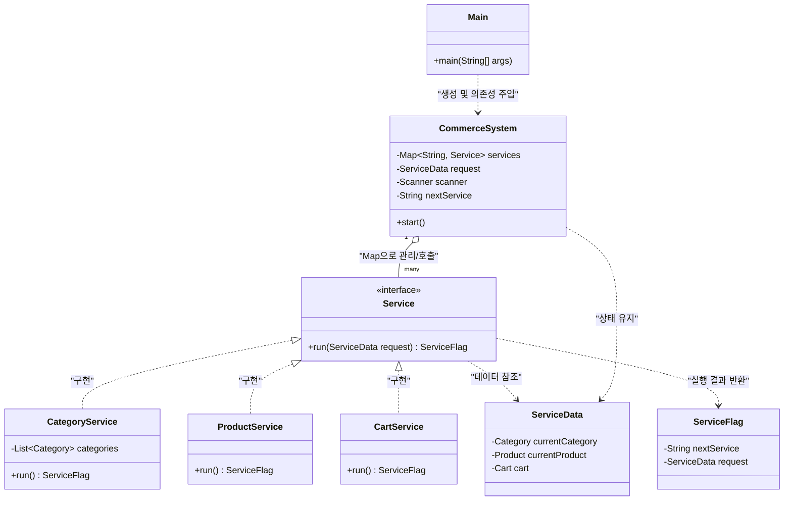

# 🛒 MyCommerceSystem

객체지향 설계(OOP) 원칙을 기반으로 커머스 플랫폼의 핵심 기능을 구현하고,
다형성과 재귀 구조를 활용해 시스템의 확장성과 유지보수성을 개선한 프로젝트입니다.

---

## 📌 프로젝트 목표

* **객체 간 협력 중심 구조 설계**
* 조건문 중심 로직을 **다형성 기반 구조로 전환**
* 유지보수성과 확장성을 고려한 시스템 구현

---

## 📂 프로젝트 구조

### 1. 패키지 구조
```bash
src/main/java/com/woolam/commerce/
├── Main.java                # 애플리케이션 진입점 및 의존성 주입
├── controller/
│   └── CommerceSystem.java  # 서비스 라우팅 및 중앙 예외 처리
├── domain/                  # 비즈니스 핵심 모델 및 상태 관리
│   ├── Cart.java            # 장바구니
│   ├── CartItem.java        # 장바구니 개별 품목
│   ├── Category.java        # 상품 분류 정보
│   ├── Customer.java        # 사용자 정보
│   ├── CustomerGrade.java   # 등급(Enum) 관리
│   └── Product.java         # 상품 명세 및 재고
├── dto/                     # 서비스 간 데이터 전송 및 상태 제어
│   ├── ServiceData.java     # 공유 데이터
│   └── ServiceFlag.java     # 실행 결과 및 다음 이동 정보
└── service/                 # 기능별 비즈니스 로직 구현체
├── Service.java         # 서비스 공통 인터페이스
├── AdminService.java    # 관리자 모드 로직
├── CartService.java     # 장바구니 및 주문 로직
├── CategoryService.java # 메인 메뉴 및 카테고리 탐색
├── CustomerService.java # 고객 관련 부가 서비스
├── OrderService.java    # 주문 처리 및 재고 관리
└── ProductService.java  # 상품 리스트 및 상세 조회
```

### 2. 클래스 다이어그램


---

## 🧠 핵심 설계

### 1. Map 기반 다형성 서비스 구조 (OCP 적용)

* `Map<String, Service>` 구조를 활용한 동적 서비스
* if-else / switch 제거
* 기능 추가 시 기존 코드 수정 없이 확장 가능

👉 **효과**

* OCP(Open-Closed Principle) 준수
* 새로운 기능 추가 비용 최소화

---

### 2. 재귀 기반 탐색 구조 리팩토링

* 카테고리 및 상품 탐색 로직을 재귀 구조로 통합
* 기존의 중첩 while + switch 구조 제거

👉 **효과**

* 코드 간결화
* 카테고리 depth 증가에도 유연하게 대응

---

### 3. 책임 분리 및 Stateless 구조

* 출력 로직을 각 객체로 위임하여 응집도 향상
* `CommerceSystem`은 상태를 직접 관리하지 않고 DTO 기반으로 동작

👉 **효과**

* 테스트 용이성 증가
* 시스템 결합도 감소

---

### 4. ServiceResponse DTO 도입

* 서비스 간 이동 정보 및 데이터를 캡슐화
* 서비스 간 직접 의존 제거

👉 **효과**

* Loose Coupling 달성
* 서비스 간 독립성 확보

---

## 🛠 주요 기능

* 상품 및 카테고리 탐색
* 장바구니 기능
* 주문 처리
* 관리자 모드 (권한 분리)

---

## 🔧 리팩토링 요약

| Before                 | After         |
| ---------------------- | ------------- |
| if-else / switch 기반 흐름 | Map 기반 다형성 구조 |
| 중첩 while 루프            | 재귀 함수         |
| 중앙 집중 로직               | 책임 분산 구조      |

---

## 🚧 문제 해결

### 서비스 실행 구조의 확장성 문제

**문제**

* 기존 구조는 `if-else` 또는 `switch` 기반으로 서비스 실행
* 새로운 기능(장바구니, 주문 등) 추가 시 기존 로직 수정 필요
* 서비스가 증가할수록 조건문이 비대해지고 유지보수 어려움 발생

---

**해결**

* `Map<String, Service>` 구조를 도입하여 서비스 라우팅을 동적으로 처리
* 각 기능을 `Service` 인터페이스 구현체로 분리
* 실행 시점에 키 값을 통해 적절한 서비스를 선택하도록 설계

---

**결과**

* 기존 코드 수정 없이 서비스 확장 가능 (OCP 준수)
* 조건문 제거로 가독성 향상
* 서비스 간 결합도 감소 및 구조 명확화

---

## 🧪 테스트 결과

### 1. 기능 테스트

* 카테고리 선택 시 해당 상품 목록이 정상적으로 출력됨
* 상품 선택 시 상세 정보가 올바르게 표시됨
* 장바구니에 상품 추가 및 목록 확인 정상 동작
* 주문 생성 시 선택한 상품이 정상적으로 반영됨
* 관리자 모드 진입 및 기능 실행 확인

---

### 2. 예외 및 경계값 테스트

* 존재하지 않는 메뉴 번호 입력 시 에러 메시지 출력 후 정상 복귀
* 상품이 없는 카테고리 선택 시 안내 메시지 출력
* 잘못된 입력(문자, 범위 초과 등)에 대한 예외 처리 검증
* 빈 장바구니 상태에서 주문 시도 시 예외 처리 확인

---

### 3. 흐름(시나리오) 테스트

* 카테고리 → 상품 → 장바구니 → 주문까지 전체 흐름 검증
* 상품 상세 조회 후 이전 카테고리로 정상 복귀
* 반복적인 메뉴 이동에도 상태가 정상 유지되는지 확인

---

### 4. 구조 리팩토링 검증

* 서비스 추가 시 기존 코드 수정 없이 정상 동작 확인 (OCP 검증)
* `Map 기반 서비스` 구조에서 신규 서비스 등록만으로 기능 확장 가능
* 재귀 기반 탐색 구조에서 카테고리 depth 증가에도 정상 동작 확인

---

## 🚀 실행 방법

### 1. 프로젝트 클론

```bash
git clone https://github.com/w00lam/MyCommerceSystem.git
cd MyCommerceSystem
```

### 2. 빌드

```bash
./gradlew build
```

### 3. 실행

```bash
./gradlew run
```

또는 IntelliJ 등 IDE에서 메인 클래스를 실행하여 확인할 수 있습니다.

---

## ⚙️ 실행 환경

* Java 17 이상
* Gradle 기반 프로젝트
* 콘솔 입력 기반 애플리케이션

---

## 📌 회고

* 객체는 단순 데이터가 아닌 **책임을 가진 단위**라는 점을 체득
* 다형성을 통한 유연한 구조 설계 경험
* 예외 처리 및 입력 검증 로직의 분리 필요성 인지
* **아쉬운점:** 
  1. 주석을 작성하다보니 함수 이름이 일관되지 못한 점이 보였다.
  2. javadocs 주석 스타일로 작성하는 습관이 필요하다.
  

---

## 🔧 개선 계획

* 주문 취소 기능 (재고 복구 로직 포함)
* 장바구니 UX 개선 (인덱스 기반 삭제 등)
* 입력 예외 처리 공통 모듈화

---

## 📄 License

This project is licensed under the MIT License.

본 프로젝트는 MIT 라이선스를 따르며, 누구나 자유롭게 사용, 수정, 배포할 수 있습니다.
단, 소프트웨어 사용에 따른 책임은 사용자에게 있습니다.